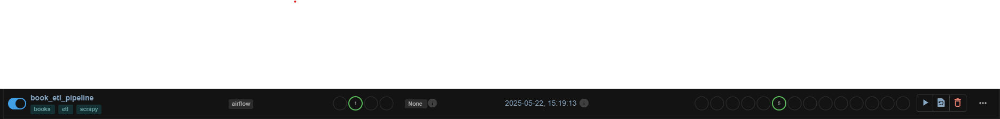
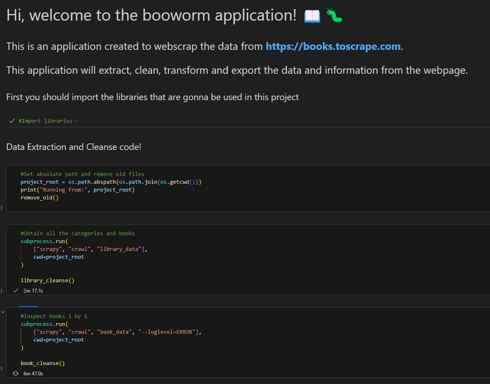
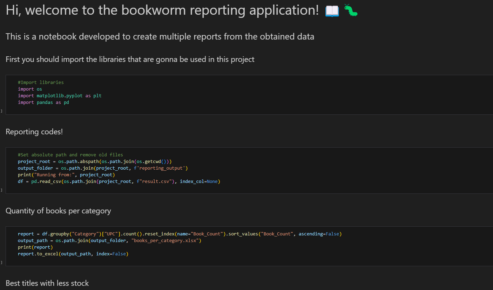

<p align="center">
  
</p>

<h1 align="center">Bookworm2Scrape Setup Guide 📖🐛</h1>

Follow these steps to set up the project on your local machine.

---

## Prerequisites

- **Python 3.12.6**  
  [Download Python](https://www.python.org/downloads/)
- **Git**  
  [Download Git](https://git-scm.com/)
  
  **If you are going to use Airflow, you should have a working workspace already**

---
## Installation for Airflow

1. **Go to your dags folder (On linux or WSL)**  
   ```bash
   cd $AIRFLOW_HOME #(if you have it configured)
   cd dags
   ```
   or
   ```bash
   your/path/to/the/dags/folder
   ```

2. **Clone the repository**  
   ```bash
   git clone https://github.com/CBossio/Bookworm2Scrape.git
   ```

3. **Install dependencies**  
   ```bash
   cd Bookworm2Scrape
   sudo apt update
   sudo apt install -y python3 python3-pip unzip wget
   wget https://dl.google.com/linux/direct/google-chrome-stable_current_amd64.deb
   sudo apt install -y ./google-chrome-stable_current_amd64.deb
   pip install -r requirements.txt
   ```

4. **Move the file "DAG - ScraperETL" and "DAG - ScraperReporting"  two folder up (outside the Bookworm2Scrape folder)** 
This step moves the DAG to the dags folder
---

## Installation for Jupyter

1. **Create a project folder**  
   Create a folder anywhere on your system to hold the project files.

2. **Open a terminal and navigate to your folder**  
   ```bash
   cd your/path/to/the/folder
   ```

3. **Clone the repository**  
   ```bash
   git clone https://github.com/CBossio/Bookworm2Scrape.git
   ```

4. **Enter the project folder**  
   ```bash
   cd Bookworm2Scrape
   ```

5. **Create a virtual environment**  
   ```bash
   python -m venv venv
   ```

6. **Activate the virtual environment**  
   ```bash
   venv\Scripts\activate
   ```

7. **Check that you're using the isolated Python**  
   ```bash
   where python
   ```

8. **Install dependencies**  
   ```bash
   pip install -r requirements.txt
   ```

---

## Execute Extraction

### Using Airflow

Just click run in the DAG

### Using Jupyter



Run all cells in order to execute the extraction process.

---

## Notes & Quick Fixes

- If you encounter multiple log errors in `failed_urls_library` or `failed_urls_book`, update the **proxies** in `settings.py`. The logs will indicate which proxy is failing.
- You might occasionally see a `charmap` codec error. This does not affect the execution of the script, because all the code is set to UTF-8.

---

## Execute Reporting

### Using Airflow


Just click run in the DAG

### Using Jupyter



Just like in the extraction step, run all cells in order to generate the report.

---
